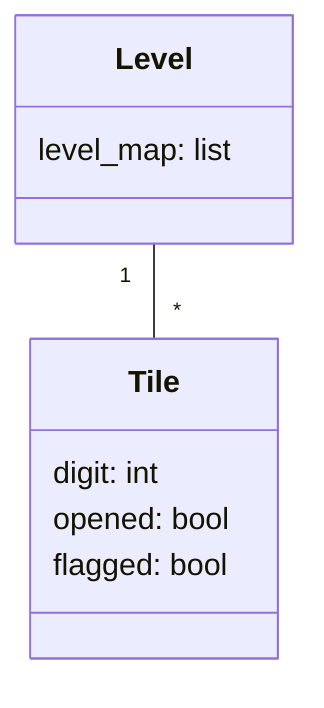

# Arkkitehtuurikuvaus

## Käyttöliittymä

Sovelluksella on yksinkertainen käyttöliittymä, joka sisältää tällä hetkellä kaksi näkymää:

- Vaikeustasonvalinta
- Pelinäkymä

Pelin avautuessa käyttäjä näkee vaikeustasonvalintanäkymän, josta vaikeustason valinnan jälkeen siirrytään suoraan pelinäkymään.

## Sovelluslogiikka

Peli toimii pääosin käyttäen Level- ja Tile-luokkia. Level-luokalle annetaan käytettävä pelikenttä listamuodossa, jonka se toteuttaa käyttäen Tile-olioita miinaharavaruudukon luomiseen.

