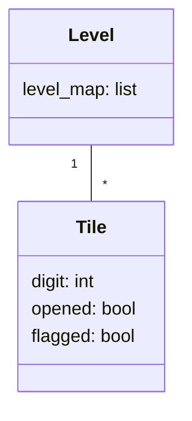
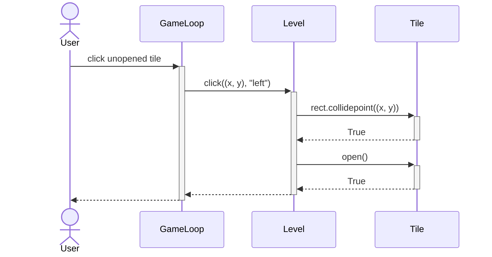

# Arkkitehtuurikuvaus

## Käyttöliittymä

Sovelluksella on yksinkertainen käyttöliittymä, joka sisältää tällä hetkellä kaksi näkymää:

- Vaikeustasonvalinta
- Pelinäkymä

Pelin avautuessa käyttäjä näkee vaikeustasonvalintanäkymän, josta vaikeustason valinnan jälkeen siirrytään suoraan pelinäkymään.

## Sovelluslogiikka

Peli toimii pääosin käyttäen Level- ja Tile-luokkia. Level-luokalle annetaan käytettävä pelikenttä listamuodossa, jonka se toteuttaa käyttäen Tile-olioita miinaharavaruudukon luomiseen.

Kun käyttäjä klikkaa peliruudukon ruutua, Level-luokka etsii klikatuissa koordinaateissa sijaitsevan Tile-olion, ja merkitsee sen avatuksi:

Tile palauttaa arvon True avaamisen jälkeen osoittaakseen, että se on juuri tällä avaamisyrityksellä avattu ruutu. Tämä on tärkeää tyhjien ruutujen ympäristöjensä avaamisen toiminnan kannalta.
