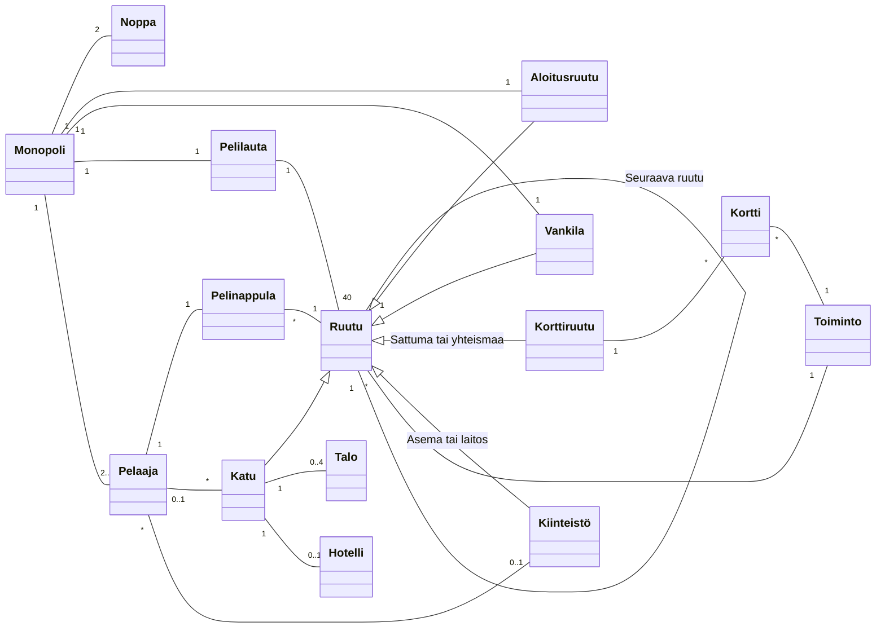

```mermaid
classDiagram
    direction LR

    Monopoli "1" -- "2" Noppa
    Monopoli "1" -- "1" Aloitusruutu
    Monopoli "1" -- "1" Vankila
    Monopoli "1" -- "1" Pelilauta
    Monopoli "1" -- "2..8" Pelaaja
    Pelaaja "1" -- "1" Pelinappula
    Pelinappula "*" -- "1" Ruutu
    Pelilauta "1" -- "40" Ruutu
    Ruutu "1" -- "1" Ruutu : Seuraava ruutu

    Ruutu <|-- Aloitusruutu
    Ruutu <|-- Vankila
    Ruutu <|-- Korttiruutu : Sattuma tai yhteismaa
    Ruutu <|-- Kiinteistö : Asema tai laitos
    Katu --|> Ruutu

    Korttiruutu "1" -- "*" Kortti
    Kortti "*" -- "1" Toiminto
    Ruutu "*" -- "1" Toiminto
    Pelaaja "0..1" -- "*" Katu
    Katu "1" -- "0..4" Talo
    Katu "1" -- "0..1" Hotelli
    Pelaaja "*" -- "0..1" Kiinteistö
```
