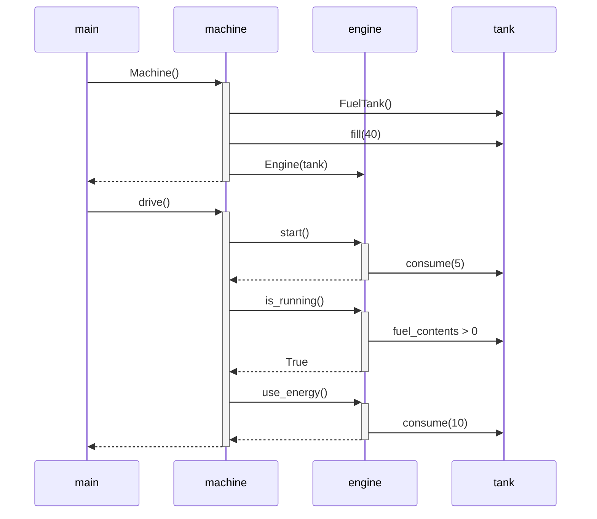

```mermaid
sequenceDiagram
    participant main
    participant machine
    participant engine
    participant tank

    main ->>+ machine: Machine()
    machine ->> tank: FuelTank()
    machine ->> tank: fill(40)
    machine ->> engine: Engine(tank)
    machine -->>- main: 

    main ->>+ machine: drive()
    machine ->>+ engine: start()
    engine ->> tank: consume(5)
    engine -->>- machine: 
    machine ->>+ engine: is_running()
    engine ->> tank: fuel_contents > 0
    engine -->>- machine: True
    machine ->>+ engine: use_energy()
    engine ->> tank: consume(10)
    engine -->>- machine: 
    machine -->>- main: 
```